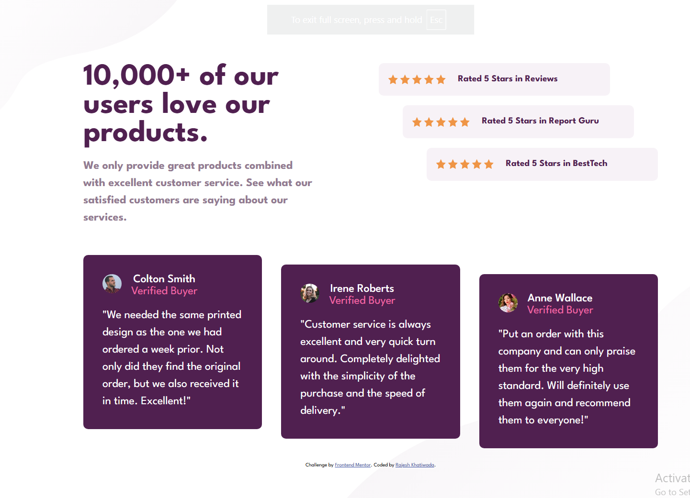

# Social Proof Section

A responsive social proof landing page section built as part of the Frontend Mentor challenge.  
This project focuses on improving layout design, responsive structure, and aligning multiple UI elements using HTML and CSS.

---

## 📸 Screenshot



---

## 🛠️ Built With

- HTML5
- CSS3
- Flexbox
- CSS Grid
- CSS Variables
- Responsive Design
- Mobile-first workflow

---

## 📌 Features

- Clean and modern social proof layout
- Rating cards with star-based styling
- Customer testimonial cards
- Fully responsive design for mobile and desktop screens
- Well-structured grid-based layout

---

## 📁 Project Structure


social-proof-section-master/
├── index.html
├── style.css
├── images/
│ └── (avatars, icons, assets)
├── screenshot.png
└── README.md


---

## 📖 What I Learned

While building this project, I practiced:

- Creating complex layouts using CSS Grid and Flexbox
- Aligning multiple UI sections in a single responsive design
- Managing spacing and hierarchy in card-based layouts
- Working with repeated components (ratings & testimonials)
- Improving responsiveness across screen sizes

---

## 🚀 Future Improvements

- Add subtle animations for testimonial cards
- Improve accessibility (ARIA labels and semantic structure)
- Convert into a React component
- Add dark mode variation

---

## 👨‍💻 Author

- GitHub: [@KhatiwadaR](https://github.com/KhatiwadaR)
```
